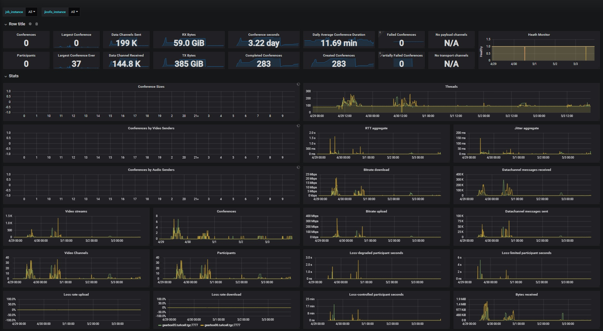

# Jitsi Prometheus Exporter (JPE)

Jitsi Prometheus Exporter (JPE) is a Spring Boot application written in Java to monitor statistics for integration of Turkcell [BiP](https://bip.com/).

JPE collects statistics from [Jitsi](https://jitsi.org) server components of [Jicofo](https://github.com/jitsi/jicofo) and [Jitsi Videobridge](https://github.com/jitsi/jitsi-videobridge), and publishes them as [Prometheus](https://prometheus.io) metrics.

JPE  request  statistics  asynchronously and periodically with configurable time interval. Aim is to collect statistics at the same time to be able to make correlation from collected statistics.

JPE can collect statistics from multiple Videobridges and multiple Jicofo's and labels statistics with their source to distinguish.

There is a [documentation](https://github.com/jitsi/jitsi-videobridge/blob/master/doc/statistics.md) of the published statistics by the video bridges.

[Jitsi Stats HTTP-API documentation](https://github.com/jitsi/jitsi-videobridge/blob/master/doc/rest.md)

## Install

* Install JDK and Maven if missing:
```sh
apt-get install openjdk-8-jdk maven
```

* Build the package.

```sh
mvn package -DskipTests
```

## Settings

* conf/app-override

```sh
# application port. Default value is 6071 if not set
server.port=6071

# list of JVB hosts with port info
jpe.jvb.metricUrls=http://videobridgeServer1:port,http://videobridgeServer2:port

# list of jicofo hosts with port info
jpe.jicofo.metricUrls=http://jicofoServers1:port,http://jicofoServers2:port

# path of the metric url for JVB. Default value is /colibri/stats if not set
jpe.jvb.metric.path=/colibri/stats

# path of the health check url for JVB. Default value is /about/health if not set
jpe.jvb.health.path=/about/health

# path of the metric url for Jicofo. Default value is /stats if not set
jpe.jicofo.metric.path=/stats

# path of the health check url for Jicofo. Default value is /about/health if not set
jpe.jicofo.health.path=/about/health

# period of health and metric check in miliseconds. Default value is 15000 if not set
jpe.stats.check.miliseconds=15000
```

* JVM Parameters

1. CONFIG_HOME must be set to show config directory.

2. Return of metric requests and application logs are generated under the LOG_DIR defined in logback.xml. To change logging options at runtime, add --logging.config=path_to_logback_xml/logback.xml.

 ```sh
/usr/bin/java -server -d64 -DCONFIG_HOME=./conf -jar ./jpe-0.0.5-SNAPSHOT.jar
 ```

 ## Dashboard

Sample dashboard.. [karrieretutor/jitsi-prom-exporter](https://grafana.com/grafana/dashboards/11925) dashboard is modified for this purpuse. You can create/use any dashboard by editing metric names only..



## Result

```sh
> curl -L -X GET 'http://host:6071/jpe/actuator/prometheus'
```

```sh
# HELP jitsi_jvb_endpoints_sending_video jitsi_jvb_endpoints_sending_video
# TYPE jitsi_jvb_endpoints_sending_video gauge
jitsi_jvb_endpoints_sending_video{host="localhost:7777",} 0.0
jitsi_jvb_endpoints_sending_video{host="localhost:7778",} 0.0
# HELP jitsi_jicofo_total_not_loaded_in_region_in_conference jitsi_jicofo_total_not_loaded_in_region_in_conference
# TYPE jitsi_jicofo_total_not_loaded_in_region_in_conference counter
# HELP jitsi_jvb_total_packets_dropped_octo jitsi_jvb_total_packets_dropped_octo
# TYPE jitsi_jvb_total_packets_dropped_octo counter
# HELP jitsi_jicofo_total_conferences_created jitsi_jicofo_total_conferences_created
# TYPE jitsi_jicofo_total_conferences_created counter
# HELP jitsi_jvb_total_loss_degraded_participant_seconds jitsi_jvb_total_loss_degraded_participant_seconds
# TYPE jitsi_jvb_total_loss_degraded_participant_seconds counter
# HELP jitsi_jicofo_total_least_loaded jitsi_jicofo_total_least_loaded
# TYPE jitsi_jicofo_total_least_loaded counter
# HELP jitsi_jvb_total_bytes_sent jitsi_jvb_total_bytes_sent
# TYPE jitsi_jvb_total_bytes_sent counter
# HELP jitsi_jicofo_conferences jitsi_jicofo_conferences
# TYPE jitsi_jicofo_conferences gauge
jitsi_jicofo_conferences{host="localhost:8889",} 0.0
jitsi_jicofo_conferences{host="localhost:8888",} 0.0
# HELP jitsi_jvb_octo_conferences jitsi_jvb_octo_conferences
# TYPE jitsi_jvb_octo_conferences gauge
jitsi_jvb_octo_conferences{host="localhost:7777",} 0.0
jitsi_jvb_octo_conferences{host="localhost:7778",} 0.0
# HELP jitsi_jvb_total_loss_controlled_participant_seconds jitsi_jvb_total_loss_controlled_participant_seconds
# TYPE jitsi_jvb_total_loss_controlled_participant_seconds counter
# HELP jitsi_jvb_inactive_endpoints jitsi_jvb_inactive_endpoints
# TYPE jitsi_jvb_inactive_endpoints gauge
jitsi_jvb_inactive_endpoints{host="localhost:7777",} 0.0
jitsi_jvb_inactive_endpoints{host="localhost:7778",} 0.0
# HELP jitsi_jvb_loss_rate_upload jitsi_jvb_loss_rate_upload
# TYPE jitsi_jvb_loss_rate_upload gauge
jitsi_jvb_loss_rate_upload{host="localhost:7777",} 0.0
jitsi_jvb_loss_rate_upload{host="localhost:7778",} 0.0
# HELP jitsi_jvb_total_conference_seconds jitsi_jvb_total_conference_seconds
# TYPE jitsi_jvb_total_conference_seconds counter
# HELP jitsi_jvb_conference_sizes_histogram jitsi_jvb_conference_sizes
# TYPE jitsi_jvb_conference_sizes_histogram histogram
# HELP jitsi_jicofo_largest_conference jitsi_jicofo_largest_conference
# TYPE jitsi_jicofo_largest_conference gauge
jitsi_jicofo_largest_conference{host="localhost:8889",} 0.0
jitsi_jicofo_largest_conference{host="localhost:8888",} 0.0
# HELP voip_Start2Ring_response_time Reason of ended dialogs
# TYPE voip_Start2Ring_response_time summary
voip_Start2Ring_response_time{quantile="0.05",} NaN
voip_Start2Ring_response_time{quantile="0.1",} NaN
voip_Start2Ring_response_time{quantile="0.5",} NaN
voip_Start2Ring_response_time{quantile="0.9",} NaN
voip_Start2Ring_response_time{quantile="0.99",} NaN
voip_Start2Ring_response_time_count 0.0
voip_Start2Ring_response_time_sum 0.0
# HELP jitsi_jvb_total_packets_received jitsi_jvb_total_packets_received
# TYPE jitsi_jvb_total_packets_received counter
# HELP jitsi_jicofo_total_least_loaded_in_region jitsi_jicofo_total_least_loaded_in_region
# TYPE jitsi_jicofo_total_least_loaded_in_region counter
# HELP jitsi_jvb_total_failed_conferences jitsi_jvb_total_failed_conferences
# TYPE jitsi_jvb_total_failed_conferences counter
# HELP jitsi_jvb_inactive_conferences jitsi_jvb_inactive_conferences
# TYPE jitsi_jvb_inactive_conferences gauge
jitsi_jvb_inactive_conferences{host="localhost:7777",} 0.0
jitsi_jvb_inactive_conferences{host="localhost:7778",} 0.0
# HELP jitsi_jvb_current_timestamp jitsi_jvb_current_timestamp
# TYPE jitsi_jvb_current_timestamp gauge
# HELP jitsi_jicofo_conference_sizes jitsi_jicofo_conference_sizes
# TYPE jitsi_jicofo_conference_sizes gauge
jitsi_jicofo_conference_sizes{host="localhost:8888",conferenceSize="8",} 0.0
jitsi_jicofo_conference_sizes{host="localhost:8888",conferenceSize="9",} 0.0
jitsi_jicofo_conference_sizes{host="localhost:8888",conferenceSize="6",} 0.0
jitsi_jicofo_conference_sizes{host="localhost:8888",conferenceSize="7",} 0.0
jitsi_jicofo_conference_sizes{host="localhost:8889",conferenceSize="16",} 0.0
jitsi_jicofo_conference_sizes{host="localhost:8889",conferenceSize="17",} 0.0
jitsi_jicofo_conference_sizes{host="localhost:8889",conferenceSize="14",} 0.0
jitsi_jicofo_conference_sizes{host="localhost:8889",conferenceSize="15",} 0.0
jitsi_jicofo_conference_sizes{host="localhost:8889",conferenceSize="12",} 0.0
jitsi_jicofo_conference_sizes{host="localhost:8889",conferenceSize="13",} 0.0
jitsi_jicofo_conference_sizes{host="localhost:8888",conferenceSize="20",} 0.0
jitsi_jicofo_conference_sizes{host="localhost:8889",conferenceSize="10",} 0.0
jitsi_jicofo_conference_sizes{host="localhost:8889",conferenceSize="11",} 0.0
jitsi_jicofo_conference_sizes{host="localhost:8889",conferenceSize="21+",} 0.0
jitsi_jicofo_conference_sizes{host="localhost:8888",conferenceSize="19",} 0.0
jitsi_jicofo_conference_sizes{host="localhost:8888",conferenceSize="17",} 0.0
jitsi_jicofo_conference_sizes{host="localhost:8888",conferenceSize="18",} 0.0
jitsi_jicofo_conference_sizes{host="localhost:8888",conferenceSize="4",} 0.0
jitsi_jicofo_conference_sizes{host="localhost:8888",conferenceSize="5",} 0.0
jitsi_jicofo_conference_sizes{host="localhost:8888",conferenceSize="2",} 0.0
jitsi_jicofo_conference_sizes{host="localhost:8888",conferenceSize="3",} 0.0
jitsi_jicofo_conference_sizes{host="localhost:8888",conferenceSize="0",} 0.0
jitsi_jicofo_conference_sizes{host="localhost:8888",conferenceSize="1",} 0.0
jitsi_jicofo_conference_sizes{host="localhost:8889",conferenceSize="20",} 0.0
jitsi_jicofo_conference_sizes{host="localhost:8889",conferenceSize="9",} 0.0
jitsi_jicofo_conference_sizes{host="localhost:8889",conferenceSize="7",} 0.0
jitsi_jicofo_conference_sizes{host="localhost:8889",conferenceSize="8",} 0.0
jitsi_jicofo_conference_sizes{host="localhost:8888",conferenceSize="15",} 0.0
jitsi_jicofo_conference_sizes{host="localhost:8888",conferenceSize="16",} 0.0
jitsi_jicofo_conference_sizes{host="localhost:8888",conferenceSize="13",} 0.0
jitsi_jicofo_conference_sizes{host="localhost:8888",conferenceSize="14",} 0.0
jitsi_jicofo_conference_sizes{host="localhost:8888",conferenceSize="11",} 0.0
jitsi_jicofo_conference_sizes{host="localhost:8888",conferenceSize="12",} 0.0
jitsi_jicofo_conference_sizes{host="localhost:8888",conferenceSize="10",} 0.0
jitsi_jicofo_conference_sizes{host="localhost:8888",conferenceSize="21+",} 0.0
jitsi_jicofo_conference_sizes{host="localhost:8889",conferenceSize="18",} 0.0
jitsi_jicofo_conference_sizes{host="localhost:8889",conferenceSize="19",} 0.0
jitsi_jicofo_conference_sizes{host="localhost:8889",conferenceSize="5",} 0.0
jitsi_jicofo_conference_sizes{host="localhost:8889",conferenceSize="6",} 0.0
jitsi_jicofo_conference_sizes{host="localhost:8889",conferenceSize="3",} 0.0
jitsi_jicofo_conference_sizes{host="localhost:8889",conferenceSize="4",} 0.0
jitsi_jicofo_conference_sizes{host="localhost:8889",conferenceSize="1",} 0.0
jitsi_jicofo_conference_sizes{host="localhost:8889",conferenceSize="2",} 0.0
jitsi_jicofo_conference_sizes{host="localhost:8889",conferenceSize="0",} 0.0
# HELP jitsi_jvb_total_data_channel_messages_sent jitsi_jvb_total_data_channel_messages_sent
# TYPE jitsi_jvb_total_data_channel_messages_sent counter
# HELP jitsi_jvb_bit_rate_upload jitsi_jvb_bit_rate_upload
# TYPE jitsi_jvb_bit_rate_upload gauge
jitsi_jvb_bit_rate_upload{host="localhost:7777",} 0.0
jitsi_jvb_bit_rate_upload{host="localhost:7778",} 0.0
# HELP jitsi_jvb_videochannels jitsi_jvb_videochannels
# TYPE jitsi_jvb_videochannels gauge
jitsi_jvb_videochannels{host="localhost:7777",} 0.0
jitsi_jvb_videochannels{host="localhost:7778",} 0.0
# HELP jitsi_jvb_total_ice_failed jitsi_jvb_total_ice_failed
# TYPE jitsi_jvb_total_ice_failed counter
# HELP jitsi_jvb_total_ice_succeeded jitsi_jvb_total_ice_succeeded
# TYPE jitsi_jvb_total_ice_succeeded counter
# HELP jitsi_jpe_unsuccessful_data_fetch JPE cannot get data from remote
# TYPE jitsi_jpe_unsuccessful_data_fetch counter
jitsi_jpe_unsuccessful_data_fetch{host="localhost:7777",source="JVB",heath="false",} 0.0
jitsi_jpe_unsuccessful_data_fetch{host="localhost:8889",source="JICOFO",heath="false",} 0.0
jitsi_jpe_unsuccessful_data_fetch{host="localhost:8888",source="JICOFO",heath="false",} 0.0
jitsi_jpe_unsuccessful_data_fetch{host="localhost:7778",source="JVB",heath="false",} 0.0
# HELP jitsi_jvb_mucs_joined jitsi_jvb_mucs_joined
# TYPE jitsi_jvb_mucs_joined gauge
jitsi_jvb_mucs_joined{host="localhost:7777",} 0.0
jitsi_jvb_mucs_joined{host="localhost:7778",} 0.0
# HELP jitsi_jvb_octo_receive_bitrate jitsi_jvb_octo_receive_bitrate
# TYPE jitsi_jvb_octo_receive_bitrate gauge
jitsi_jvb_octo_receive_bitrate{host="localhost:7777",} 0.0
jitsi_jvb_octo_receive_bitrate{host="localhost:7778",} 0.0
# HELP jitsi_jvb_packet_rate_download jitsi_jvb_packet_rate_download
# TYPE jitsi_jvb_packet_rate_download gauge
jitsi_jvb_packet_rate_download{host="localhost:7777",} 0.0
jitsi_jvb_packet_rate_download{host="localhost:7778",} 0.0
# HELP jitsi_jvb_total_data_channel_messages_received jitsi_jvb_total_data_channel_messages_received
# TYPE jitsi_jvb_total_data_channel_messages_received counter
# HELP jitsi_jicofo_total_split_due_to_load jitsi_jicofo_total_split_due_to_load
# TYPE jitsi_jicofo_total_split_due_to_load counter
# HELP jitsi_jicofo_operational_bridge_count jitsi_jicofo_operational_bridge_count
# TYPE jitsi_jicofo_operational_bridge_count gauge
jitsi_jicofo_operational_bridge_count{host="localhost:8889",} 0.0
jitsi_jicofo_operational_bridge_count{host="localhost:8888",} 0.0
# HELP jitsi_jvb_total_colibri_web_socket_messages_sent jitsi_jvb_total_colibri_web_socket_messages_sent
# TYPE jitsi_jvb_total_colibri_web_socket_messages_sent counter
# HELP jitsi_jvb_total_packets_sent jitsi_jvb_total_packets_sent
# TYPE jitsi_jvb_total_packets_sent counter
# HELP jitsi_jvb_total_bytes_sent_octo jitsi_jvb_total_bytes_sent_octo
# TYPE jitsi_jvb_total_bytes_sent_octo counter
# HELP jitsi_jvb_conferences_by_audio_senders jitsi_jvb_conferences_by_audio_senders
# TYPE jitsi_jvb_conferences_by_audio_senders gauge
jitsi_jvb_conferences_by_audio_senders{host="localhost:7777",conferenceSize="19",} 0.0
jitsi_jvb_conferences_by_audio_senders{host="localhost:7777",conferenceSize="18",} 0.0
jitsi_jvb_conferences_by_audio_senders{host="localhost:7777",conferenceSize="17",} 0.0
jitsi_jvb_conferences_by_audio_senders{host="localhost:7777",conferenceSize="5",} 0.0
jitsi_jvb_conferences_by_audio_senders{host="localhost:7777",conferenceSize="4",} 0.0
jitsi_jvb_conferences_by_audio_senders{host="localhost:7777",conferenceSize="3",} 0.0
jitsi_jvb_conferences_by_audio_senders{host="localhost:7777",conferenceSize="2",} 0.0
jitsi_jvb_conferences_by_audio_senders{host="localhost:7777",conferenceSize="1",} 0.0
jitsi_jvb_conferences_by_audio_senders{host="localhost:7777",conferenceSize="0",} 0.0
jitsi_jvb_conferences_by_audio_senders{host="localhost:7778",conferenceSize="21+",} 0.0
jitsi_jvb_conferences_by_audio_senders{host="localhost:7777",conferenceSize="9",} 0.0
jitsi_jvb_conferences_by_audio_senders{host="localhost:7777",conferenceSize="8",} 0.0
jitsi_jvb_conferences_by_audio_senders{host="localhost:7777",conferenceSize="7",} 0.0
jitsi_jvb_conferences_by_audio_senders{host="localhost:7777",conferenceSize="6",} 0.0
jitsi_jvb_conferences_by_audio_senders{host="localhost:7778",conferenceSize="17",} 0.0
jitsi_jvb_conferences_by_audio_senders{host="localhost:7778",conferenceSize="16",} 0.0
jitsi_jvb_conferences_by_audio_senders{host="localhost:7778",conferenceSize="15",} 0.0
jitsi_jvb_conferences_by_audio_senders{host="localhost:7778",conferenceSize="14",} 0.0
jitsi_jvb_conferences_by_audio_senders{host="localhost:7778",conferenceSize="13",} 0.0
jitsi_jvb_conferences_by_audio_senders{host="localhost:7778",conferenceSize="12",} 0.0
jitsi_jvb_conferences_by_audio_senders{host="localhost:7778",conferenceSize="11",} 0.0
jitsi_jvb_conferences_by_audio_senders{host="localhost:7777",conferenceSize="20",} 0.0
jitsi_jvb_conferences_by_audio_senders{host="localhost:7778",conferenceSize="10",} 0.0
jitsi_jvb_conferences_by_audio_senders{host="localhost:7778",conferenceSize="19",} 0.0
jitsi_jvb_conferences_by_audio_senders{host="localhost:7778",conferenceSize="18",} 0.0
jitsi_jvb_conferences_by_audio_senders{host="localhost:7778",conferenceSize="6",} 0.0
jitsi_jvb_conferences_by_audio_senders{host="localhost:7778",conferenceSize="5",} 0.0
jitsi_jvb_conferences_by_audio_senders{host="localhost:7778",conferenceSize="4",} 0.0
jitsi_jvb_conferences_by_audio_senders{host="localhost:7778",conferenceSize="3",} 0.0
jitsi_jvb_conferences_by_audio_senders{host="localhost:7778",conferenceSize="2",} 0.0
jitsi_jvb_conferences_by_audio_senders{host="localhost:7778",conferenceSize="1",} 0.0
jitsi_jvb_conferences_by_audio_senders{host="localhost:7777",conferenceSize="21+",} 0.0
jitsi_jvb_conferences_by_audio_senders{host="localhost:7778",conferenceSize="0",} 0.0
jitsi_jvb_conferences_by_audio_senders{host="localhost:7778",conferenceSize="20",} 0.0
jitsi_jvb_conferences_by_audio_senders{host="localhost:7778",conferenceSize="9",} 0.0
jitsi_jvb_conferences_by_audio_senders{host="localhost:7778",conferenceSize="8",} 0.0
jitsi_jvb_conferences_by_audio_senders{host="localhost:7778",conferenceSize="7",} 0.0
jitsi_jvb_conferences_by_audio_senders{host="localhost:7777",conferenceSize="16",} 0.0
jitsi_jvb_conferences_by_audio_senders{host="localhost:7777",conferenceSize="15",} 0.0
jitsi_jvb_conferences_by_audio_senders{host="localhost:7777",conferenceSize="14",} 0.0
jitsi_jvb_conferences_by_audio_senders{host="localhost:7777",conferenceSize="13",} 0.0
jitsi_jvb_conferences_by_audio_senders{host="localhost:7777",conferenceSize="12",} 0.0
jitsi_jvb_conferences_by_audio_senders{host="localhost:7777",conferenceSize="11",} 0.0
jitsi_jvb_conferences_by_audio_senders{host="localhost:7777",conferenceSize="10",} 0.0
# HELP jitsi_jicofo_bridge_count jitsi_jicofo_bridge_count
# TYPE jitsi_jicofo_bridge_count gauge
jitsi_jicofo_bridge_count{host="localhost:8889",} 0.0
jitsi_jicofo_bridge_count{host="localhost:8888",} 0.0
# HELP jitsi_jvb_videostreams jitsi_jvb_videostreams
# TYPE jitsi_jvb_videostreams gauge
jitsi_jvb_videostreams{host="localhost:7777",} 0.0
jitsi_jvb_videostreams{host="localhost:7778",} 0.0
# HELP jitsi_jvb_jitter_aggregate jitsi_jvb_jitter_aggregate
# TYPE jitsi_jvb_jitter_aggregate gauge
jitsi_jvb_jitter_aggregate{host="localhost:7777",} 0.0
jitsi_jvb_jitter_aggregate{host="localhost:7778",} 0.0
# HELP jitsi_jvb_octo_endpoints jitsi_jvb_octo_endpoints
# TYPE jitsi_jvb_octo_endpoints gauge
jitsi_jvb_octo_endpoints{host="localhost:7777",} 0.0
jitsi_jvb_octo_endpoints{host="localhost:7778",} 0.0
# HELP jitsi_jvb_total_conferences_created jitsi_jvb_total_conferences_created
# TYPE jitsi_jvb_total_conferences_created counter
# HELP jitsi_jvb_num_eps_no_msg_transport_after_delay jitsi_jvb_num_eps_no_msg_transport_after_delay
# TYPE jitsi_jvb_num_eps_no_msg_transport_after_delay gauge
jitsi_jvb_num_eps_no_msg_transport_after_delay{host="localhost:7777",} 0.0
jitsi_jvb_num_eps_no_msg_transport_after_delay{host="localhost:7778",} 0.0
# HELP jitsi_jvb_conferences jitsi_jvb_conferences
# TYPE jitsi_jvb_conferences gauge
jitsi_jvb_conferences{host="localhost:7777",} 0.0
jitsi_jvb_conferences{host="localhost:7778",} 0.0
# HELP system_cpu_usage The "recent cpu usage" for the whole system
# TYPE system_cpu_usage gauge
system_cpu_usage 1.0
# HELP jitsi_jicofo_total_recording_failures jitsi_jicofo_total_recording_failures
# TYPE jitsi_jicofo_total_recording_failures counter
# HELP jitsi_jvb_total_colibri_web_socket_messages_received jitsi_jvb_total_colibri_web_socket_messages_received
# TYPE jitsi_jvb_total_colibri_web_socket_messages_received counter
# HELP process_uptime_seconds The uptime of the Java virtual machine
# TYPE process_uptime_seconds gauge
process_uptime_seconds 9.77
# HELP jitsi_jicofo_conference_sizes_histogram jitsi_jicofo_conference_sizes
# TYPE jitsi_jicofo_conference_sizes_histogram histogram
# HELP jitsi_jvb_total_participants jitsi_jvb_total_participants
# TYPE jitsi_jvb_total_participants counter
# HELP jitsi_jvb_muc_clients_connected jitsi_jvb_muc_clients_connected
# TYPE jitsi_jvb_muc_clients_connected gauge
jitsi_jvb_muc_clients_connected{host="localhost:7777",} 0.0
jitsi_jvb_muc_clients_connected{host="localhost:7778",} 0.0
# HELP jitsi_jvb_total_dominant_speaker_changes jitsi_jvb_total_dominant_speaker_changes
# TYPE jitsi_jvb_total_dominant_speaker_changes counter
# HELP jitsi_jvb_rtt_aggregate jitsi_jvb_rtt_aggregate
# TYPE jitsi_jvb_rtt_aggregate gauge
jitsi_jvb_rtt_aggregate{host="localhost:7777",} 0.0
jitsi_jvb_rtt_aggregate{host="localhost:7778",} 0.0
# HELP jitsi_jvb_largest_conference jitsi_jvb_largest_conference
# TYPE jitsi_jvb_largest_conference gauge
jitsi_jvb_largest_conference{host="localhost:7777",} 0.0
jitsi_jvb_largest_conference{host="localhost:7778",} 0.0
# HELP jitsi_jvb_conferences_by_video_senders jitsi_jvb_conferences_by_video_senders
# TYPE jitsi_jvb_conferences_by_video_senders gauge
jitsi_jvb_conferences_by_video_senders{host="localhost:7777",conferenceSize="19",} 0.0
jitsi_jvb_conferences_by_video_senders{host="localhost:7777",conferenceSize="18",} 0.0
jitsi_jvb_conferences_by_video_senders{host="localhost:7777",conferenceSize="17",} 0.0
jitsi_jvb_conferences_by_video_senders{host="localhost:7777",conferenceSize="5",} 0.0
jitsi_jvb_conferences_by_video_senders{host="localhost:7777",conferenceSize="4",} 0.0
jitsi_jvb_conferences_by_video_senders{host="localhost:7777",conferenceSize="3",} 0.0
jitsi_jvb_conferences_by_video_senders{host="localhost:7777",conferenceSize="2",} 0.0
jitsi_jvb_conferences_by_video_senders{host="localhost:7777",conferenceSize="1",} 0.0
jitsi_jvb_conferences_by_video_senders{host="localhost:7777",conferenceSize="0",} 0.0
jitsi_jvb_conferences_by_video_senders{host="localhost:7778",conferenceSize="21+",} 0.0
jitsi_jvb_conferences_by_video_senders{host="localhost:7777",conferenceSize="9",} 0.0
jitsi_jvb_conferences_by_video_senders{host="localhost:7777",conferenceSize="8",} 0.0
jitsi_jvb_conferences_by_video_senders{host="localhost:7777",conferenceSize="7",} 0.0
jitsi_jvb_conferences_by_video_senders{host="localhost:7777",conferenceSize="6",} 0.0
jitsi_jvb_conferences_by_video_senders{host="localhost:7778",conferenceSize="17",} 0.0
jitsi_jvb_conferences_by_video_senders{host="localhost:7778",conferenceSize="16",} 0.0
jitsi_jvb_conferences_by_video_senders{host="localhost:7778",conferenceSize="15",} 0.0
jitsi_jvb_conferences_by_video_senders{host="localhost:7778",conferenceSize="14",} 0.0
jitsi_jvb_conferences_by_video_senders{host="localhost:7778",conferenceSize="13",} 0.0
jitsi_jvb_conferences_by_video_senders{host="localhost:7778",conferenceSize="12",} 0.0
jitsi_jvb_conferences_by_video_senders{host="localhost:7778",conferenceSize="11",} 0.0
jitsi_jvb_conferences_by_video_senders{host="localhost:7777",conferenceSize="20",} 0.0
jitsi_jvb_conferences_by_video_senders{host="localhost:7778",conferenceSize="10",} 0.0
jitsi_jvb_conferences_by_video_senders{host="localhost:7778",conferenceSize="19",} 0.0
jitsi_jvb_conferences_by_video_senders{host="localhost:7778",conferenceSize="18",} 0.0
jitsi_jvb_conferences_by_video_senders{host="localhost:7778",conferenceSize="6",} 0.0
jitsi_jvb_conferences_by_video_senders{host="localhost:7778",conferenceSize="5",} 0.0
jitsi_jvb_conferences_by_video_senders{host="localhost:7778",conferenceSize="4",} 0.0
jitsi_jvb_conferences_by_video_senders{host="localhost:7778",conferenceSize="3",} 0.0
jitsi_jvb_conferences_by_video_senders{host="localhost:7778",conferenceSize="2",} 0.0
jitsi_jvb_conferences_by_video_senders{host="localhost:7778",conferenceSize="1",} 0.0
jitsi_jvb_conferences_by_video_senders{host="localhost:7777",conferenceSize="21+",} 0.0
jitsi_jvb_conferences_by_video_senders{host="localhost:7778",conferenceSize="0",} 0.0
jitsi_jvb_conferences_by_video_senders{host="localhost:7778",conferenceSize="20",} 0.0
jitsi_jvb_conferences_by_video_senders{host="localhost:7778",conferenceSize="9",} 0.0
jitsi_jvb_conferences_by_video_senders{host="localhost:7778",conferenceSize="8",} 0.0
jitsi_jvb_conferences_by_video_senders{host="localhost:7778",conferenceSize="7",} 0.0
jitsi_jvb_conferences_by_video_senders{host="localhost:7777",conferenceSize="16",} 0.0
jitsi_jvb_conferences_by_video_senders{host="localhost:7777",conferenceSize="15",} 0.0
jitsi_jvb_conferences_by_video_senders{host="localhost:7777",conferenceSize="14",} 0.0
jitsi_jvb_conferences_by_video_senders{host="localhost:7777",conferenceSize="13",} 0.0
jitsi_jvb_conferences_by_video_senders{host="localhost:7777",conferenceSize="12",} 0.0
jitsi_jvb_conferences_by_video_senders{host="localhost:7777",conferenceSize="11",} 0.0
jitsi_jvb_conferences_by_video_senders{host="localhost:7777",conferenceSize="10",} 0.0
# HELP jitsi_jvb_packet_rate_upload jitsi_jvb_packet_rate_upload
# TYPE jitsi_jvb_packet_rate_upload gauge
jitsi_jvb_packet_rate_upload{host="localhost:7777",} 0.0
jitsi_jvb_packet_rate_upload{host="localhost:7778",} 0.0
# HELP jitsi_jvb_total_packets_sent_octo jitsi_jvb_total_packets_sent_octo
# TYPE jitsi_jvb_total_packets_sent_octo counter
# HELP jitsi_jicofo_total_split_due_to_region jitsi_jicofo_total_split_due_to_region
# TYPE jitsi_jicofo_total_split_due_to_region counter
# HELP jitsi_jicofo_total_least_loaded_in_conference jitsi_jicofo_total_least_loaded_in_conference
# TYPE jitsi_jicofo_total_least_loaded_in_conference counter
# HELP jitsi_jvb_endpoints_sending_audio jitsi_jvb_endpoints_sending_audio
# TYPE jitsi_jvb_endpoints_sending_audio gauge
jitsi_jvb_endpoints_sending_audio{host="localhost:7777",} 0.0
jitsi_jvb_endpoints_sending_audio{host="localhost:7778",} 0.0
# HELP jitsi_jicofo_health_status jitsi_jicofo_health_status
# TYPE jitsi_jicofo_health_status gauge
jitsi_jicofo_health_status{host="localhost:8889",} 0.0
jitsi_jicofo_health_status{host="localhost:8888",} 0.0
# HELP jitsi_jvb_total_bytes_received_octo jitsi_jvb_total_bytes_received_octo
# TYPE jitsi_jvb_total_bytes_received_octo counter
# HELP jitsi_jvb_conferences_by_video_senders_histogram jitsi_jvb_conferences_by_video_senders
# TYPE jitsi_jvb_conferences_by_video_senders_histogram histogram
# HELP jitsi_jvb_receive_only_endpoints jitsi_jvb_receive_only_endpoints
# TYPE jitsi_jvb_receive_only_endpoints gauge
jitsi_jvb_receive_only_endpoints{host="localhost:7777",} 0.0
jitsi_jvb_receive_only_endpoints{host="localhost:7778",} 0.0
# HELP jitsi_jvb_muc_clients_configured jitsi_jvb_muc_clients_configured
# TYPE jitsi_jvb_muc_clients_configured gauge
jitsi_jvb_muc_clients_configured{host="localhost:7777",} 0.0
jitsi_jvb_muc_clients_configured{host="localhost:7778",} 0.0
# HELP jitsi_jvb_bit_rate_download jitsi_jvb_bit_rate_download
# TYPE jitsi_jvb_bit_rate_download gauge
jitsi_jvb_bit_rate_download{host="localhost:7777",} 0.0
jitsi_jvb_bit_rate_download{host="localhost:7778",} 0.0
# HELP jitsi_jvb_loss_rate_download jitsi_jvb_loss_rate_download
# TYPE jitsi_jvb_loss_rate_download gauge
jitsi_jvb_loss_rate_download{host="localhost:7777",} 0.0
jitsi_jvb_loss_rate_download{host="localhost:7778",} 0.0
# HELP jitsi_jvb_participants jitsi_jvb_participants
# TYPE jitsi_jvb_participants gauge
jitsi_jvb_participants{host="localhost:7777",} 0.0
jitsi_jvb_participants{host="localhost:7778",} 0.0
# HELP jitsi_jvb_octo_receive_packet_rate jitsi_jvb_octo_receive_packet_rate
# TYPE jitsi_jvb_octo_receive_packet_rate gauge
jitsi_jvb_octo_receive_packet_rate{host="localhost:7777",} 0.0
jitsi_jvb_octo_receive_packet_rate{host="localhost:7778",} 0.0
# HELP jitsi_jvb_rtp_loss jitsi_jvb_rtp_loss
# TYPE jitsi_jvb_rtp_loss gauge
jitsi_jvb_rtp_loss{host="localhost:7777",} 0.0
jitsi_jvb_rtp_loss{host="localhost:7778",} 0.0
# HELP jitsi_jicofo_total_least_loaded_in_region_in_conference jitsi_jicofo_total_least_loaded_in_region_in_conference
# TYPE jitsi_jicofo_total_least_loaded_in_region_in_conference counter
# HELP jitsi_jvb_total_packets_received_octo jitsi_jvb_total_packets_received_octo
# TYPE jitsi_jvb_total_packets_received_octo counter
# HELP jitsi_jicofo_participants jitsi_jicofo_participants
# TYPE jitsi_jicofo_participants gauge
jitsi_jicofo_participants{host="localhost:8889",} 0.0
jitsi_jicofo_participants{host="localhost:8888",} 0.0
# HELP process_cpu_usage The "recent cpu usage" for the Java Virtual Machine process
# TYPE process_cpu_usage gauge
process_cpu_usage 0.10850242351013152
# HELP jitsi_jvb_octo_send_bitrate jitsi_jvb_octo_send_bitrate
# TYPE jitsi_jvb_octo_send_bitrate gauge
jitsi_jvb_octo_send_bitrate{host="localhost:7777",} 0.0
jitsi_jvb_octo_send_bitrate{host="localhost:7778",} 0.0
# HELP jitsi_jicofo_total_participants jitsi_jicofo_total_participants
# TYPE jitsi_jicofo_total_participants counter
# HELP jitsi_jvb_octo_send_packet_rate jitsi_jvb_octo_send_packet_rate
# TYPE jitsi_jvb_octo_send_packet_rate gauge
jitsi_jvb_octo_send_packet_rate{host="localhost:7777",} 0.0
jitsi_jvb_octo_send_packet_rate{host="localhost:7778",} 0.0
# HELP jitsi_jicofo_total_not_loaded_in_region jitsi_jicofo_total_not_loaded_in_region
# TYPE jitsi_jicofo_total_not_loaded_in_region counter
# HELP jitsi_jvb_total_ice_succeeded_relayed jitsi_jvb_total_ice_succeeded_relayed
# TYPE jitsi_jvb_total_ice_succeeded_relayed counter
# HELP jitsi_jvb_health_status jitsi_jvb_conferences_by_audio_senders
# TYPE jitsi_jvb_health_status gauge
jitsi_jvb_health_status{host="localhost:7777",} 0.0
jitsi_jvb_health_status{host="localhost:7778",} 0.0
# HELP jitsi_jvb_total_conferences_completed jitsi_jvb_total_conferences_completed
# TYPE jitsi_jvb_total_conferences_completed counter
# HELP jitsi_jvb_total_bytes_received jitsi_jvb_total_bytes_received
# TYPE jitsi_jvb_total_bytes_received counter
# HELP jitsi_jicofo_total_live_streaming_failures jitsi_jicofo_total_live_streaming_failures
# TYPE jitsi_jicofo_total_live_streaming_failures counter
# HELP jitsi_jvb_conferences_by_audio_senders_histogram jitsi_jvb_conferences_by_audio_senders
# TYPE jitsi_jvb_conferences_by_audio_senders_histogram histogram
# HELP jitsi_jvb_total_partially_failed_conferences jitsi_jvb_total_partially_failed_conferences
# TYPE jitsi_jvb_total_partially_failed_conferences counter
# HELP jitsi_jvb_conference_sizes jitsi_jvb_conference_sizes
# TYPE jitsi_jvb_conference_sizes gauge
jitsi_jvb_conference_sizes{host="localhost:7777",conferenceSize="19",} 0.0
jitsi_jvb_conference_sizes{host="localhost:7777",conferenceSize="18",} 0.0
jitsi_jvb_conference_sizes{host="localhost:7777",conferenceSize="17",} 0.0
jitsi_jvb_conference_sizes{host="localhost:7777",conferenceSize="5",} 0.0
jitsi_jvb_conference_sizes{host="localhost:7777",conferenceSize="4",} 0.0
jitsi_jvb_conference_sizes{host="localhost:7777",conferenceSize="3",} 0.0
jitsi_jvb_conference_sizes{host="localhost:7777",conferenceSize="2",} 0.0
jitsi_jvb_conference_sizes{host="localhost:7777",conferenceSize="1",} 0.0
jitsi_jvb_conference_sizes{host="localhost:7777",conferenceSize="0",} 0.0
jitsi_jvb_conference_sizes{host="localhost:7778",conferenceSize="21+",} 0.0
jitsi_jvb_conference_sizes{host="localhost:7777",conferenceSize="9",} 0.0
jitsi_jvb_conference_sizes{host="localhost:7777",conferenceSize="8",} 0.0
jitsi_jvb_conference_sizes{host="localhost:7777",conferenceSize="7",} 0.0
jitsi_jvb_conference_sizes{host="localhost:7777",conferenceSize="6",} 0.0
jitsi_jvb_conference_sizes{host="localhost:7778",conferenceSize="17",} 0.0
jitsi_jvb_conference_sizes{host="localhost:7778",conferenceSize="16",} 0.0
jitsi_jvb_conference_sizes{host="localhost:7778",conferenceSize="15",} 0.0
jitsi_jvb_conference_sizes{host="localhost:7778",conferenceSize="14",} 0.0
jitsi_jvb_conference_sizes{host="localhost:7778",conferenceSize="13",} 0.0
jitsi_jvb_conference_sizes{host="localhost:7778",conferenceSize="12",} 0.0
jitsi_jvb_conference_sizes{host="localhost:7778",conferenceSize="11",} 0.0
jitsi_jvb_conference_sizes{host="localhost:7777",conferenceSize="20",} 0.0
jitsi_jvb_conference_sizes{host="localhost:7778",conferenceSize="10",} 0.0
jitsi_jvb_conference_sizes{host="localhost:7778",conferenceSize="19",} 0.0
jitsi_jvb_conference_sizes{host="localhost:7778",conferenceSize="18",} 0.0
jitsi_jvb_conference_sizes{host="localhost:7778",conferenceSize="6",} 0.0
jitsi_jvb_conference_sizes{host="localhost:7778",conferenceSize="5",} 0.0
jitsi_jvb_conference_sizes{host="localhost:7778",conferenceSize="4",} 0.0
jitsi_jvb_conference_sizes{host="localhost:7778",conferenceSize="3",} 0.0
jitsi_jvb_conference_sizes{host="localhost:7778",conferenceSize="2",} 0.0
jitsi_jvb_conference_sizes{host="localhost:7778",conferenceSize="1",} 0.0
jitsi_jvb_conference_sizes{host="localhost:7777",conferenceSize="21+",} 0.0
jitsi_jvb_conference_sizes{host="localhost:7778",conferenceSize="0",} 0.0
jitsi_jvb_conference_sizes{host="localhost:7778",conferenceSize="20",} 0.0
jitsi_jvb_conference_sizes{host="localhost:7778",conferenceSize="9",} 0.0
jitsi_jvb_conference_sizes{host="localhost:7778",conferenceSize="8",} 0.0
jitsi_jvb_conference_sizes{host="localhost:7778",conferenceSize="7",} 0.0
jitsi_jvb_conference_sizes{host="localhost:7777",conferenceSize="16",} 0.0
jitsi_jvb_conference_sizes{host="localhost:7777",conferenceSize="15",} 0.0
jitsi_jvb_conference_sizes{host="localhost:7777",conferenceSize="14",} 0.0
jitsi_jvb_conference_sizes{host="localhost:7777",conferenceSize="13",} 0.0
jitsi_jvb_conference_sizes{host="localhost:7777",conferenceSize="12",} 0.0
jitsi_jvb_conference_sizes{host="localhost:7777",conferenceSize="11",} 0.0
jitsi_jvb_conference_sizes{host="localhost:7777",conferenceSize="10",} 0.0
# HELP jitsi_jicofo_total_sip_call_failures jitsi_jicofo_total_sip_call_failures
# TYPE jitsi_jicofo_total_sip_call_failures counter
# HELP process_start_time_seconds Start time of the process since unix epoch.
# TYPE process_start_time_seconds gauge
process_start_time_seconds 1.589124922872E9
# HELP jitsi_jvb_total_loss_limited_participant_seconds jitsi_jvb_total_loss_limited_participant_seconds
# TYPE jitsi_jvb_total_loss_limited_participant_seconds counter
# HELP jitsi_jvb_p2p_conferences jitsi_jvb_p2p_conferences
# TYPE jitsi_jvb_p2p_conferences gauge
jitsi_jvb_p2p_conferences{host="localhost:7777",} 0.0
jitsi_jvb_p2p_conferences{host="localhost:7778",} 0.0
# HELP jitsi_jvb_total_ice_succeeded_tcp jitsi_jvb_total_ice_succeeded_tcp
# TYPE jitsi_jvb_total_ice_succeeded_tcp counter
# HELP system_cpu_count The number of processors available to the Java virtual machine
# TYPE system_cpu_count gauge
system_cpu_count 8.0
# HELP jitsi_jvb_mucs_configured jitsi_jvb_mucs_configured
# TYPE jitsi_jvb_mucs_configured gauge
jitsi_jvb_mucs_configured{host="localhost:7777",} 0.0
jitsi_jvb_mucs_configured{host="localhost:7778",} 0.0
# HELP jitsi_jvb_threads jitsi_jvb_threads
# TYPE jitsi_jvb_threads gauge
jitsi_jvb_threads{host="localhost:7777",} 0.0
jitsi_jvb_threads{host="localhost:7778",} 0.0

```

## To-do

Adding xmpp support to collect metrics is planned.
